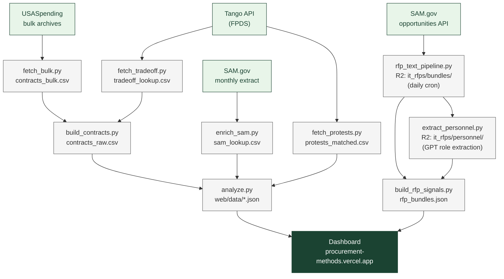

# How the Federal Government Buys IT Services

An open analysis of federal IT procurement — how agencies compete and evaluate contracts
for custom software, systems design, and related IT services.

**[View the dashboard →](https://procurement-methods.vercel.app)**

---

## What this is

This project pulls federal contract data from public sources and classifies every IT services
contract by how it was evaluated:

- **LPTA** (Lowest Price Technically Acceptable)
- **Best-Value Tradeoff**
- **Fair Opportunity** (IDIQ/GWAC task orders)
- **Negotiated Proposal** (full and open competition)
- **Simplified Acquisition**
- **Sole Source**

It also runs a daily pipeline that downloads solicitation attachments from SAM.gov, extracts
the text, and builds a browsable table of notices with vocabulary signals and personnel
requirements pulled from the documents.

NAICS scope: **541511** (Custom Programming), **541512** (Systems Design),
**541519** (Other Computer Services), **518210** (Data Processing/Hosting).

---

## Dashboard

The dashboard has two main sections:

**Contract Analysis** — charts and filters for FY2022–present:
- Evaluation method breakdown (count and dollars)
- Trend over time by fiscal year
- Vendor age and new-entrant rates
- Agency-level LPTA rates
- Engagement type (deliverable/FFP vs. staff-aug/T&M)
- Small business set-aside rates
- Top vendors table

**Notice Browser** — searchable table of SAM.gov solicitation notices:
- Filterable by notice type, department, NAICS, set-aside, date range, and vocabulary signals
- Badges showing what data is available for each notice (personnel roles, vocabulary signals, full text)
- Modal with extracted attachment text, keyword snippets, and GPT-extracted personnel roles
- Sourced from daily pipeline pulling ~200–400 notices/day across target NAICS codes

---

## How it works

### Contracts pipeline

```
fetch_bulk.py           USASpending bulk archives → data/contracts_bulk.csv
                        (contract details: dollars, agencies, vendors, competition fields)

fetch_tradeoff.py       Tango API (FPDS) → data/tradeoff_lookup.csv
                        (LPTA vs. best-value tradeoff codes — not in USASpending)

build_contracts.py      Join bulk + tradeoff → data/contracts_raw.csv
                        (classifies each contract into an eval_method)

enrich_sam.py           SAM.gov monthly extract → data/sam_lookup.csv
                        (vendor age, registration date, employee count)

fetch_protests.py       Tango API → data/protests_matched.csv
                        (GAO bid protests matched to IT solicitations)

analyze.py              contracts_raw + SAM + protests → web/data/*.json
                        (dashboard data files committed for Vercel)
```

### Notice browser pipeline

```
rfp_text_pipeline.py    Daily cron (00:05 UTC): SAM.gov attachment text → R2
                        (pypdf/python-docx/openpyxl extraction, regex label classifier)

extract_personnel.py    GPT extraction of personnel roles/qualifications from bundles
                        (caches to R2 at it_rfps/personnel/{noticeId}.json)

build_rfp_signals.py    R2 bundles → web/data/rfp_signals.json + rfp_bundles.json
                        (aggregates signals, loads personnel cache, deduplicates by sol number)
```

### Mermaid diagram



---

## Quick start

```bash
pip install -r requirements.txt

# API keys in .env
echo "TANGO_API_KEY=your_key" >> .env
echo "SAM_API_KEY=your_key"   >> .env
echo "OPENAI_API_KEY=your_key" >> .env  # for extract_personnel.py

# Contracts pipeline (USASpending needs no key)
python3 fetch_bulk.py --fy 2026
python3 fetch_tradeoff.py        # rate-limited; run daily
python3 build_contracts.py
python3 enrich_sam.py            # optional: vendor age
python3 fetch_protests.py        # optional: GAO protests
python3 analyze.py

# Notice browser (R2 credentials required)
python3 build_rfp_signals.py     # pull bundles from R2, build rfp_bundles.json
python3 extract_personnel.py     # optional: GPT personnel extraction

# View locally
cd web && python3 -m http.server 8000
```

All scripts are checkpoint/resume-safe — re-run after rate limits or interruptions.

---

## Methodology

### Evaluation method classification

Two separate fields with different sources and coverage.

**`eval_method`** — always populated, derived from USASpending competition fields:

| Category | Rule |
|----------|------|
| Fair Opportunity | `solicitation_procedures_code = "MAFO"` |
| Negotiated Proposal | `extent_competed` in (A, D) and `solicitation_procedures = "NP"` |
| Simplified Acquisition | `extent_competed` in (F, G) |
| Sole Source | `solicitation_procedures = "SSS"` |
| Not Competed | `extent_competed` in (B, C), not sole source |

**`tradeoff_code`** — partial coverage, from Tango API (FPDS `tradeoff_process`):

| Value | Meaning |
|-------|---------|
| `LPTA` | Lowest Price Technically Acceptable |
| `TO` | Best-Value Tradeoff |
| `O` | Other |
| null | Not yet fetched or not reported (~40–60% of awards) |

### Notice browser labels

Labels are computed by regex on extracted attachment text:

| Label | Signal |
|-------|--------|
| shall clauses | Count of "shall" requirements |
| user vocab | "user story", "user research", "human-centered", etc. |
| agile vocab | "sprint", "scrum", "kanban", "backlog", etc. |
| RTM | "requirements traceability matrix" |

### Caveats

- **Tradeoff code coverage is partial.** FPDS `tradeoff_process` is contractor-reported and blank for ~40–60% of awards. Coverage grows daily as `fetch_tradeoff.py` runs (100 calls/day free tier).
- **USASpending is transaction-level.** We aggregate to one row per contract, taking the latest modification for categorical fields.
- **SAM entity data is self-reported.** Employee counts and start dates may be blank or inaccurate.
- **RFP text extraction misses image-only PDFs.** No OCR yet; coverage ~76% of attachments.
- **Personnel extraction is GPT-based.** Results are good-faith extractions; roles may not exactly match solicitation language.

---

## Data sources

| Source | What it provides | Access |
|--------|-----------------|--------|
| [USASpending](https://www.usaspending.gov) bulk archives | Contract details (75 fields per transaction) | Free, no key |
| [Tango API](https://govcon.dev) (FPDS) | LPTA/tradeoff codes, GAO protests | Free tier: 100 calls/day |
| [SAM.gov](https://sam.gov) | Monthly entity extract (vendor age/registration); opportunities API (solicitations) | Free API key |
| OpenAI API | Personnel role extraction from attachment text | Paid (gpt-4o-mini) |

---

## GitHub Actions

| Workflow | Schedule | What it does |
|----------|----------|-------------|
| `rfp_text.yml` | Daily 00:05 UTC | Fetch SAM.gov solicitation attachments → R2 |
| `fetch_tradeoff.yml` | Daily 10:00 UTC | Fetch LPTA/tradeoff codes from Tango API |
| `fetch.yml` | Monthly | Download USASpending bulk archives |
| `rebuild.yml` | After tradeoff fetch | Rebuild dashboard JSONs; data tests gate the commit |

R2 (Cloudflare) stores pipeline state and bundles between runs.

---

## License

MIT
