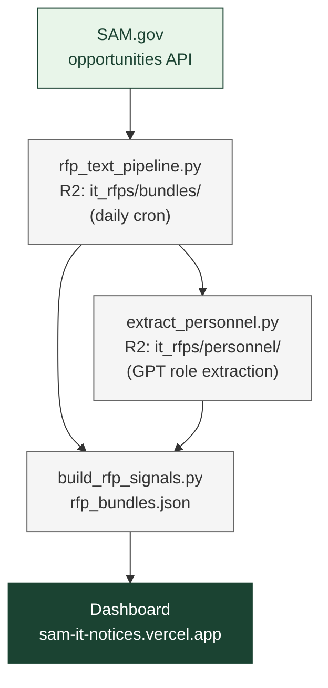

# How the Federal Government Buys IT Services

A daily pipeline + browsable dashboard of federal IT solicitations. We pull
attachments from SAM.gov, extract the text, run a regex/GPT signal pass, and
serve a filterable notice browser.

**[View the dashboard →](https://sam-it-notices.vercel.app)**

NAICS scope: **541511** (Custom Programming) and **541512** (Systems Design).
The text pipeline also keeps related codes under prefix `541` (e.g. 541519).

---

## Dashboard

Searchable table of SAM.gov notices:

- Filter by notice type, department, NAICS, set-aside, date range, and
  vocabulary signals
- Per-notice badges showing what data is available (personnel roles,
  vocabulary signals, full extracted text, LCATs)
- Modal with extracted attachment text, keyword snippets, and GPT-extracted
  personnel roles / labor categories

Filters are also shareable via URL — every chip you add is reflected in the
query string (e.g. `?dept=DEPT+OF+DEFENSE&naics=541512`).

---

## Pipeline

```
rfp_text_pipeline.py    Daily cron (00:05 UTC). SAM.gov opportunities API →
                        R2 (it_rfps/bundles/). pypdf / python-docx / openpyxl
                        text extraction; regex label classifier.

extract_personnel.py    GPT-based extraction of personnel roles / LCATs from
                        new bundles. Caches to R2 (it_rfps/personnel/).

build_rfp_signals.py    Reads bundles + personnel cache from R2, writes
                        web/data/rfp_signals.json + rfp_bundles.json. These
                        are the only files the dashboard fetches.
```



---

## Quick start

```bash
pip install -r requirements.txt
python -m playwright install chromium    # for frontend tests

# API keys in .env
echo "SAM_API_KEY=your_key"    >> .env
echo "OPENAI_API_KEY=your_key" >> .env  # for extract_personnel.py
# R2 credentials also required: CF_R2_ACCOUNT_ID, CF_R2_BUCKET,
# CF_R2_ACCESS_KEY_ID, CF_R2_SECRET_ACCESS_KEY

# Build dashboard JSONs from R2 bundles
python3 build_rfp_signals.py

# View locally
cd web && python3 -m http.server 8000
```

All scripts are checkpoint/resume-safe — re-run after rate limits or interruptions.

---

## Labels

Computed by regex over extracted attachment text:

| Label | Signal |
|-------|--------|
| shall clauses | Count of "shall" requirements |
| user vocab | "user story", "user research", "human-centered", etc. |
| agile vocab | "sprint", "scrum", "kanban", "backlog", etc. |
| RTM | "requirements traceability matrix" |

### Caveats

- **Text extraction misses image-only PDFs.** No OCR yet; coverage ~76% of
  attachments.
- **Personnel extraction is GPT-based.** Roles are good-faith extractions and
  may not match solicitation language verbatim.

---

## Data sources

| Source | What it provides | Access |
|--------|-----------------|--------|
| [SAM.gov](https://sam.gov) | Opportunities API + attachment downloads | Free API key |
| OpenAI API | Personnel role extraction from attachment text | Paid (gpt-4o-mini) |
| Cloudflare R2 | Pipeline state + bundle storage between runs | Account required |

---

## GitHub Actions

| Workflow | Schedule | What it does |
|----------|----------|--------------|
| `rfp_text.yml` | Daily 00:05 UTC | Pipeline → personnel extraction → rebuild dashboard JSONs → run data + frontend tests → commit `web/data/` + push (Vercel deploys on push) |

The commit-and-push step is gated on the test suites. If `tests/data/` or
`tests/frontend/` fail, no commit is made and the previous build keeps
serving.

---

## License

MIT
